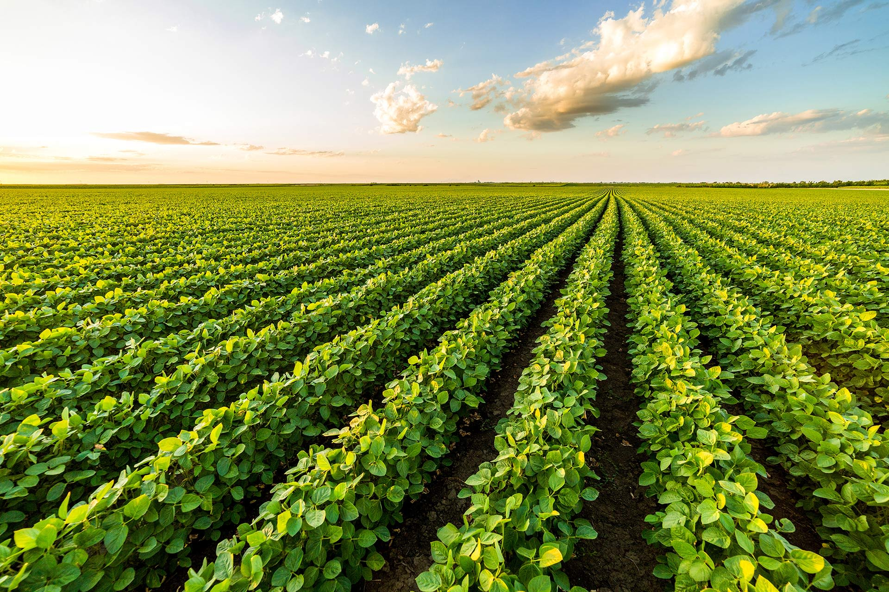
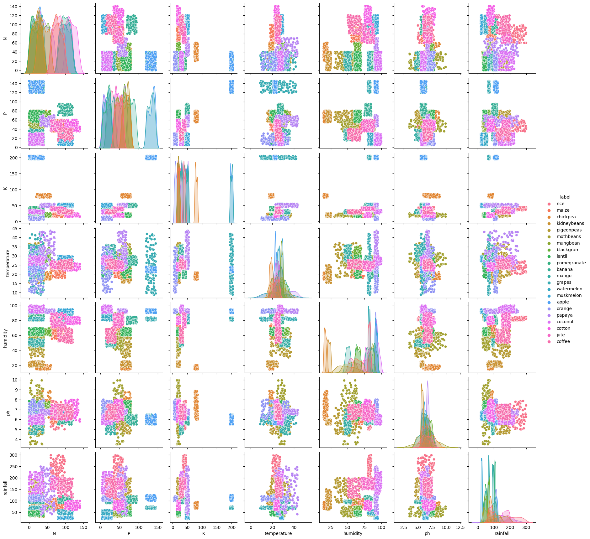
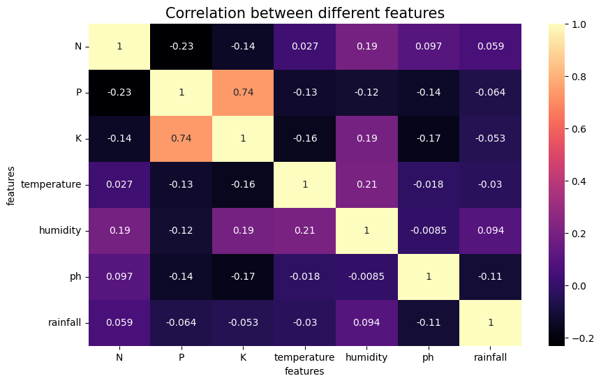
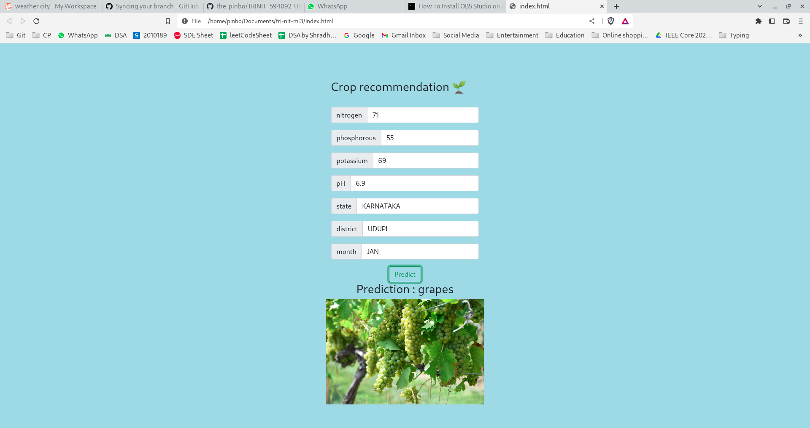

# Crop Prediction using Machine Learning

## Overview

This project aims to develop a machine learning based crop-prediction model to support farmers in making informed decisions about crop selection, planting, and harvesting. The model was trained on a large dataset of historical crop and weather data, using deep learning techniques. The results of the model showed high accuracy in predicting crop yield, surpassing the performance of traditional crop prediction methods. The model has been deployed with user-friendly interface, thus enabling farmers to input a few values and obtain informed decisions about when and what to plant. This project represents a significant step forward in using ML to improve the efficiency and profitability of agriculture.

## Data

The data used to train the model was collected from the [Crop Prediction](https://www.kaggle.com/datasets/atharvaingle/crop-recommendation-dataset) dataset. The dataset consists of 2200 samples of 22 different crops whose predictions are made using 7 features: nitrogen, phosphorus, potassium, and pH content of the soil, temperature, humidity and rainfall. The dataset is perfectly balanced, with each crop having 100 samples. The [Rainfall in India](https://www.kaggle.com/datasets/rajanand/rainfall-in-india) datset is used to cross reference geolocations to corresponding rainfall values. The data was pre-processed to ensure consistency and cleaned to remove any missing values. The data includes information on various crop types, weather patterns, and soil types. The following data visualization was performed on the [Crop Prediction](https://www.kaggle.com/datasets/atharvaingle/crop-recommendation-dataset) dataset:

- Pairwise correlation plots for the features

- Correlation Matrix

## Model

The model is built using Deep Neural Networks(DNNs). The architecture we have chosen consists of 3 hidden layers with 64, 128 and 64 neurons respectively, and an output layer of 22 neurons, each corresponding to one type of crop. The activation function in the input and hidden layers is [SeLU](https://pytorch.org/docs/stable/generated/torch.nn.SELU.html), while the activation function for the output layer is softmax. The model was created using PyTorch framework.

## Training

The model was trained on the data with a 80:20 train-test split ratio. The objective(loss) function used was categorical crossentropy, and the optimizer used was ADAM. The performance metric used to evaluate the model is accuracy. Training was done for 100 epochs.

## Results

The model achieved an accuracy of 99% on the train data, and an accuracy of about 99% on the test data, indicating a high level of accuracy in its predictions.

<!-- The vizualization of the performance is shown as follows: -->

## Testing

The following data is collected from the end-user to make predictions:

1. N, P, K, pH content of the soil.
2. Geolocation (State and District)
3. Month(Season) of cultivation

The geolocation is used to obtain the temperature and humidity values of the place, using appropriate API calls to weather forecasting sites. The following sites were accessed through API calls for climate data:

1. [Open Weather](http://api.openweathermap.org/)
2. [Latitude and Logitude Finder](https://www.latlong.net)

Further, we have created an interactive interface for users to enter relevant data to get predictions for their crop.

## Credits

The contributors would like to acknowledge the guidance and technical support provided by the following individuals:

1. [Chinamya Sharma](https://github.com/ChinmayaSharma-hue)
2. [Vinayak Vatsalya](https://github.com/vinayakj02)
3. [Muthukumar Sridharan](https://github.com/BenzeneAlcohol)